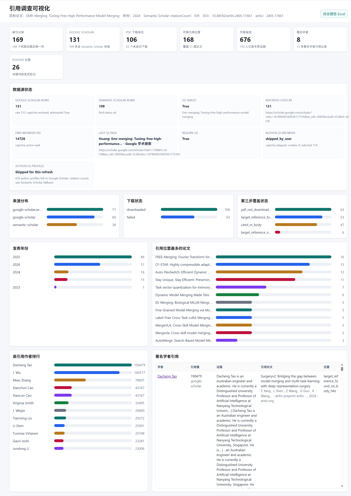

# Paper Citation Researcher Skill

这是一个可直接安装到 Codex/Claude 项目本地 skills 目录的 citation-research workflow 包。

## 文件

- `paper-citation-researcher-skill.zip`: skill 压缩包，解压后根目录为 `paper-citation-researcher/`。
- `paper-citation-researcher/`: 可直接查看和安装的 skill 源目录。
- `assets/9fce4155-66ce-445b-83ba-9e1b66cc5a30.png`: dashboard 效果预览图。
- `SHA256SUMS.txt`: zip 文件的 SHA-256 校验值。

## 功能

- 按论文标题或 DOI 查询 citing papers。
- 同时支持 Google Scholar 和 Semantic Scholar。
- Google Scholar 默认使用 `--scholar-locale zh-CN`，并按 reported cited-by count 翻页。
- `citing_papers.csv` 中 Google Scholar 和 Semantic Scholar 的 `citation_count` 均不会留空；无引用数时写 `0`。
- 下载可公开访问的 PDF，并生成失败下载清单。
- 从 PDF 中定位目标论文的参考文献条目，再输出可靠的正文引用位置、逐论文覆盖率报告、Excel 汇总和自包含 HTML dashboard。

## 效果预览



## 环境配置

推荐环境：

- Windows 10/11 或 Linux/macOS。
- Python 3.10+。Windows 上优先使用 Python Launcher，也就是 `py` 命令。
- Edge、Chrome 或 Firefox 浏览器。默认浏览器参数是 `--browser edge`。
- 可访问 Google Scholar、Semantic Scholar、arXiv、出版社页面等网络资源。

检查 Python：

```powershell
py -V
py -0p
```

如果 `python` 命令打开 Microsoft Store 或提示找不到 Python，属于 Windows 的 App Execution Alias 干扰；优先使用 `py`，或在系统设置里关闭 `python.exe` / `python3.exe` 的 App Execution Alias。

建议使用虚拟环境：

```powershell
cd "$env:CODEX_HOME\skills\paper-citation-researcher"
py -3 -m venv .venv
.\.venv\Scripts\Activate.ps1
python -m pip install --upgrade pip
python -m pip install -r requirements.txt
```

如果 PowerShell 阻止激活虚拟环境，可先执行：

```powershell
Set-ExecutionPolicy -Scope CurrentUser RemoteSigned
```

激活虚拟环境后，用 `python` 运行脚本；未激活虚拟环境时，用 `py` 更稳：

```powershell
python scripts/paper_citation_researcher.py --help
py scripts/paper_citation_researcher.py --help
```

依赖检查：

```powershell
python -c "import bs4, openpyxl, pandas, pypdf, requests, selenium; print('ok')"
```

可选环境变量：

```powershell
$env:SEMANTIC_SCHOLAR_API_KEY = "<your-api-key>"
```

如果希望长期保存：

```powershell
setx SEMANTIC_SCHOLAR_API_KEY "<your-api-key>"
```

Semantic Scholar API key 不是必需项；不设置也能运行，只是匿名请求更容易遇到限流。这个 skill 的 find/download/analyze 流程不需要 OpenAI API key。

## 安装

将 zip 解压到目标环境的 skills 目录，例如：

```powershell
Expand-Archive .\paper-citation-researcher-skill.zip -DestinationPath "$env:CODEX_HOME\skills"
cd "$env:CODEX_HOME\skills\paper-citation-researcher"
py -m pip install -r requirements.txt
```

如果目标项目使用项目本地 skills 目录，也可以解压到：

```text
<project>/.claude/skills/
```

## 使用

```powershell
cd "$env:CODEX_HOME\skills\paper-citation-researcher"
py scripts/paper_citation_researcher.py run --paper "Attention Is All You Need" --output ".\citation-output" --max-papers 1000 --browser edge --scholar-locale zh-CN --download-workers 4
```

重新生成已有结果目录的 dashboard：

```powershell
py scripts/paper_citation_researcher.py dashboard --output ".\citation-output"
```

可选配置：

- `SEMANTIC_SCHOLAR_API_KEY`: Semantic Scholar API key，可不设置。
- `--s2-api-key` / `--s2-api-key-env`: 覆盖默认 API key 来源。
- `--max-papers`: 默认 `1000`。

## 验证

本包生成前已通过：

```powershell
py scripts/test_merge_and_download_logic.py
py scripts/test_scholar_url_logic.py
```
